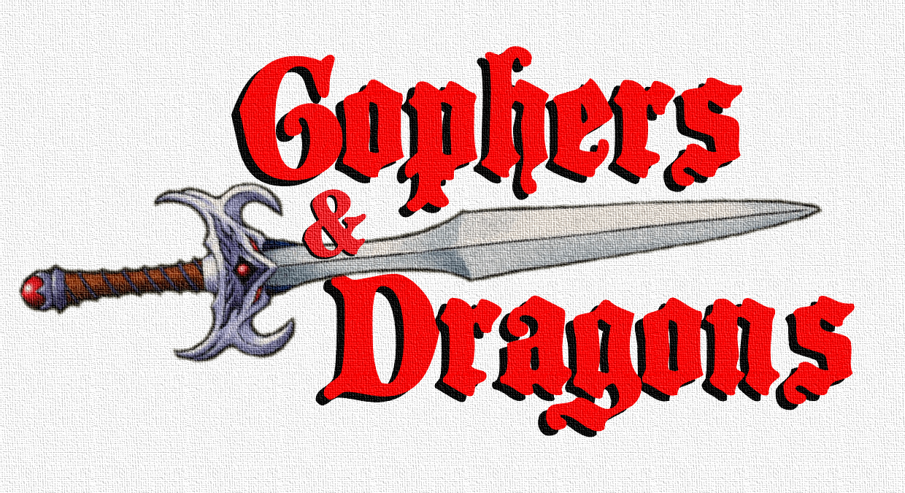

# The manual

## Basics

In order to pass the game you need to survive all **rounds**.

A **round** is an encounter with a single **creep**.

Your avatar is controlled by a code snipped that we'll call a **tactic**.

A **tactic** must provide `ChooseCard(s game.State) game.CardType` function. That function is called for every **turn**.

The following tactic is a minimal solution for this (don't expect to get a high **score** with it):

```go
package tactic

import "github.com/quasilyte/gophers-and-dragons/game"

func ChooseCard(s game.State) game.CardType {
	return game.CardRetreat
}
```

How to earn **score**:

1. Defeat creeps.
2. Survive all rounds and get a survival bonus.

So, a better tactic actually tries to fight some monsters.

```go
package tactic

import "github.com/quasilyte/gophers-and-dragons/game"

func ChooseCard(s game.State) game.CardType {
	if s.Avatar.HP < 10 {
		// If have a Heal card and enough MP to cast it, use it.
		if s.Can(game.CardHeal) {
			return game.CardHeal
		}
		return game.CardRetreat // Otherwise run away
	}

	// Fight only weak monsters and run away from everything else.
	switch s.Creep.Type {
	case game.CreepCheepy, game.CreepImp, game.CreepLion:
		return game.CardAttack
	default:
		return game.CardRetreat
	}
}
```

The [game](https://godoc.org/github.com/quasilyte/gophers-and-dragons/game) package contains most information that you'll need while writing your own tactic.

## Controls

| Name | Description |
|---|---|
| Run button | Start the tactic simulation |
| Pause/Resume button | Switch between pause/running modes in simulation; bound to space key |
| Next Turn button | Advance 1 turn forward; only works when paused |
| Format button | Apply an auto code formatting fix |
| Share button | Copy a shareable link into your system clipboard; max sharable code size is limited |
| Speed select | Adjust the simulation running speed |

## Cards

Cards that have no usage limit:

| Name | Effect | MP |
|---|---|---|
| Attack | Deal 2-4 damage | 0 |
| MagicArrow | Deal 3 **magic** damage | 1 |
| Retreat | Skip the current creep; you take a hit from it, unless it's **slow** | 0 |
| Rest | Recover 3 HP | 2 |


Cards that need to be obtained before becoming available:

| Name | Effect | MP |
|---|---|---|
| PowerAttack | Deal 4-5 damage | 0 |
| Stun | Enemy skips 2 turns | 0 |
| Firebolt | Deal 4-6 **fire magic** damage | 3 |
| Heal | Recover 10-15 HP | 4 |
| Parry | Reflect the next enemy attack back to itself, unless it's **ranged** | 0 |

## Creeps

| Name | HP | Damage | Traits | Score | Cards dropped | 
|---|---|---|---|---|---|
| Cheepy | 4 | 1-4 | Coward | 3 | 1 |
| Imp | 5 | 3-4 || 5 | 1 |
| Lion | 10 | 2-3 || 6 | 2 |
| Fairy | 9 | 4-5 | Ranged | 11 | 2 |
| Mummy | 18 | 3-4 | WeakToFire, Slow | 15 | 3 |
| Dragon | 30 | 5-6 | MagicImmunity | 35 | 0 |

## Creep traits

| Name | Effect |
|---|---|
| Coward | Doesn't attack until you attack it first |
| Ranged | Attacks can't be parried |
| WeakToFire | Fire attacks deal x2 damage |
| Slow | When running away from a slow enemy, no damage is taken |
| MagicImmunity | 100% magic damage resist |
